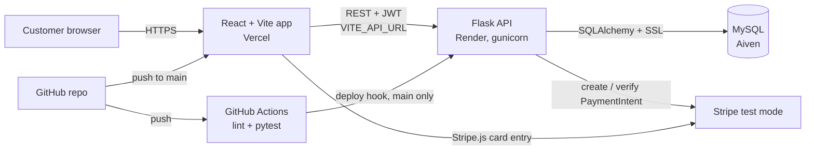

# Architecture Diagram (as built)

**Notes**
- The frontend calls the backend directly; CORS allows only the Vercel origin and localhost.
- Card details go from the browser to Stripe; the backend only handles payment intents.
- Deployment to Render is triggered by the pipeline only after tests pass.
