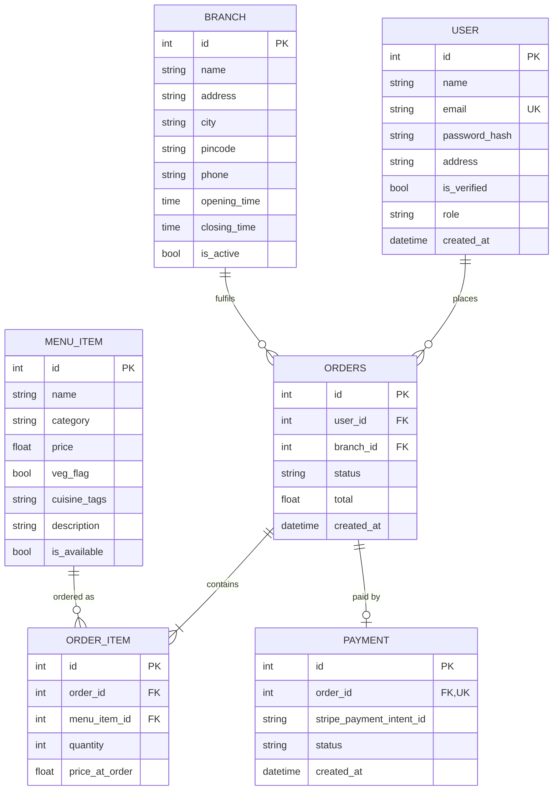

# ER Diagram (as built)

**Design notes**
- The menu has no branch link: it is shared by every branch.
- `price_at_order` keeps past orders correct if a menu price changes.
- `PAYMENT.order_id` is unique: one payment row per order.
- The table is named `ORDERS` here because `ORDER` is a reserved word; in the database it is `order`.
