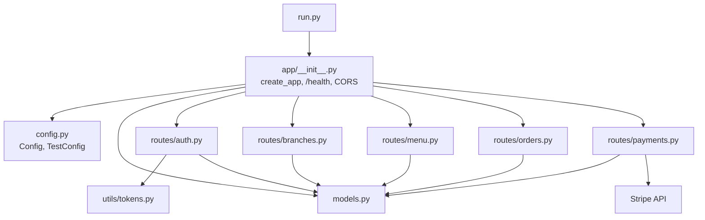
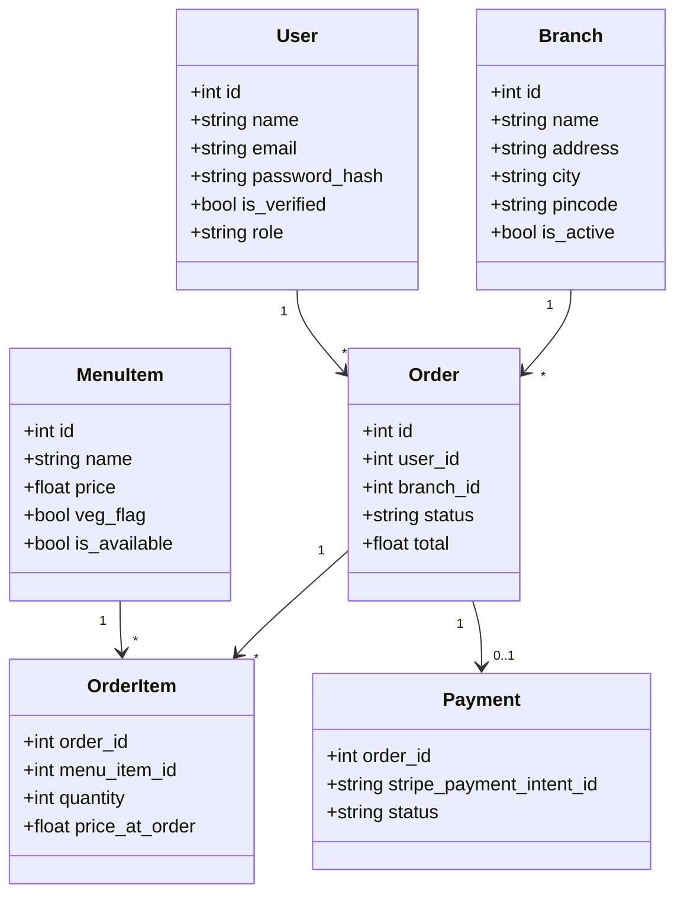
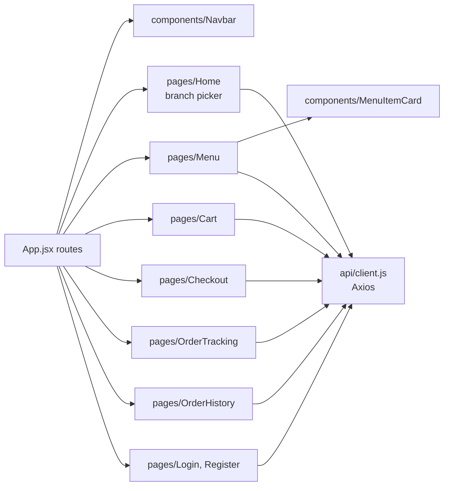

# Class / Module Diagram (as built)

## Backend modules

```mermaid
flowchart TB
    run[run.py] --> app["app/__init__.py<br/>create_app, /health, CORS"]
    app --> cfg[config.py<br/>Config, TestConfig]
    app --> models[models.py]
    app --> auth[routes/auth.py]
    app --> branches[routes/branches.py]
    app --> menu[routes/menu.py]
    app --> orders[routes/orders.py]
    app --> payments[routes/payments.py]
    auth --> tokens[utils/tokens.py]
    auth --> models
    branches --> models
    menu --> models
    orders --> models
    payments --> models
    payments --> stripe[Stripe API]
```

## Model classes

```mermaid
classDiagram
    class User {
        +int id
        +string name
        +string email
        +string password_hash
        +bool is_verified
        +string role
    }
    class Branch {
        +int id
        +string name
        +string address
        +string city
        +string pincode
        +bool is_active
    }
    class MenuItem {
        +int id
        +string name
        +float price
        +bool veg_flag
        +bool is_available
    }
    class Order {
        +int id
        +int user_id
        +int branch_id
        +string status
        +float total
    }
    class OrderItem {
        +int order_id
        +int menu_item_id
        +int quantity
        +float price_at_order
    }
    class Payment {
        +int order_id
        +string stripe_payment_intent_id
        +string status
    }
    User "1" --> "*" Order
    Branch "1" --> "*" Order
    Order "1" --> "*" OrderItem
    MenuItem "1" --> "*" OrderItem
    Order "1" --> "0..1" Payment
```

## Frontend modules

```mermaid
flowchart LR
    App[App.jsx routes] --> Nav[components/Navbar]
    App --> Home[pages/Home<br/>branch picker]
    App --> Menu[pages/Menu]
    Menu --> Card[components/MenuItemCard]
    App --> Cart[pages/Cart]
    App --> Checkout[pages/Checkout]
    App --> Track[pages/OrderTracking]
    App --> Hist[pages/OrderHistory]
    App --> Auth[pages/Login, Register]
    Home & Menu & Cart & Checkout & Track & Hist & Auth --> API[api/client.js<br/>Axios]
```
